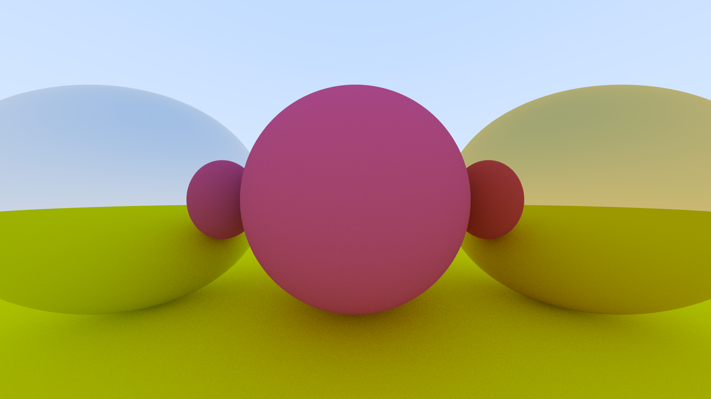

# RayTracingInOneSabbatical
My December 2021 implementation of the famous crash course ["Ray Tracing in One Weekend"](https://raytracing.github.io/books/RayTracingInOneWeekend.html#overview).

During the time of December 2021, I took a month break between jobs. During that time, one of the projects that consumed my time was this course.

# Example image

